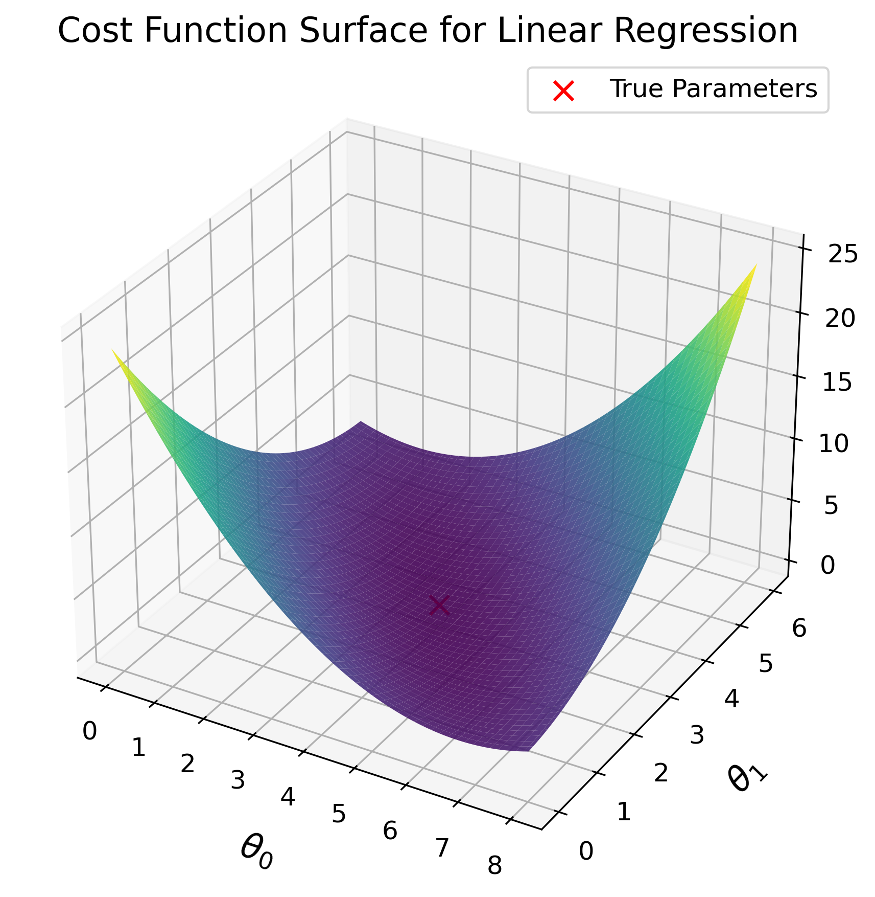
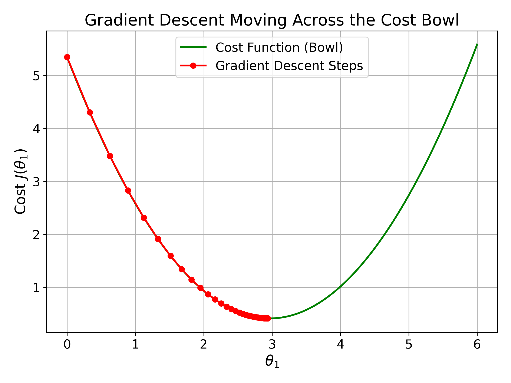
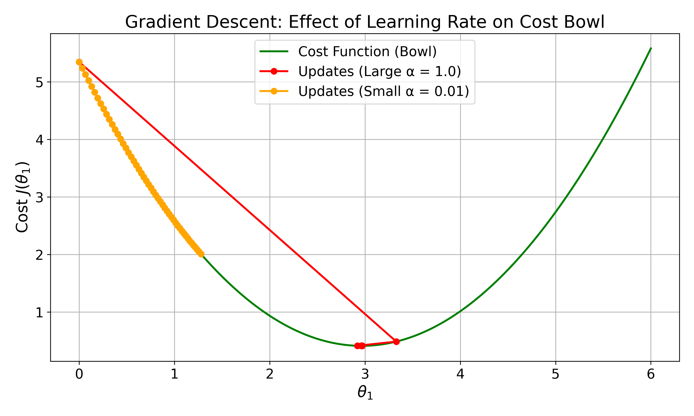
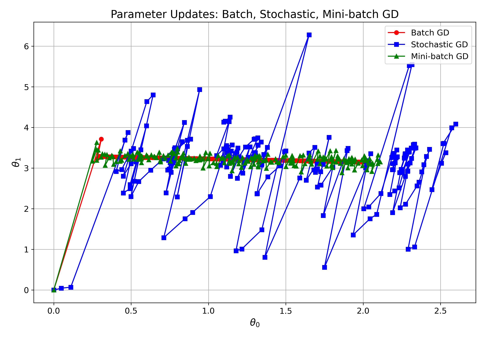

# Linear Regression and Gradient Descent

This week, we will look into Linear Regression. 

## Introduction to Linear Regression

Linear Regression is one of the simplest and most widely used supervised learning algorithms. The goal is to model the relationship between input features and a continuous output variable. The hypothesis function assumes a **linear** relationship between these variables. This method finds applications in various domains such as predicting house prices, forecasting sales, and estimating risk scores.

## Linear Regression with One Variable

The simplest case of linear regression involves one input feature and one output variable. The hypothesis function represents a straight line with two parameters: the intercept and the slope. 

```math

h_\theta(x) = \theta_0 + \theta_1 x

```

The intercept represents the value of the output variable when the input feature is zero, while the slope indicates the change in the output variable for a unit change in the input feature. A common example is predicting house prices based on the size of the house.

## Univariate Linear Regression

In practice, we often work with datasets that exhibit a linear relationship with some added noise. The regression line that best fits the data points is determined through optimization. This line minimizes the overall error between predicted and actual values across all data points in the dataset.

## Cost Function

To evaluate how well our proposed regression line fits the training data, we need a measure of error. The most common measure is the Mean Squared Error. For each training example, we calculate the difference between the predicted value and the actual value. We square this difference to ensure that negative and positive errors do not cancel each other out. Then, we take the average of these squared errors across all training examples. 

```math

J(\theta) = \frac{1}{2m} \sum_{i=1}^{m} \Big( h_\theta(x^{(i)}) - y^{(i)} \Big)^2

```

The goal is to find parameter values that make this cost as small as possible.

## Cost Function Visualization

The cost function can be visualized as a surface where each point represents the cost for specific parameter values. The optimal parameters correspond to the lowest point on this surface, which represents the minimum cost.

 
Figure: 3D surface plot of the cost function showing the minimum point


## Multiple Linear Regression

When we have two input features, the hypothesis extends naturally to represent a plane in three-dimensional space that best fits the training data. 

```math

h_\theta(x) = \theta_0 + \theta_1 x_1 + \theta_2 x_2

```

For example, predicting house price might involve both the size of the house and the number of bedrooms as input features.

With multiple input features, the hypothesis becomes more comprehensive, incorporating each feature with its respective parameter. 

```math

h_\theta(x) = \theta_0 + \theta_1 x_1 + \theta_2 x_2 + \cdots + \theta_n x_n

```

This can be represented using compact matrix notation for efficiency and clarity. 

```math

h_\theta(x) = \theta^T x

```

Applications of multiple linear regression include price prediction, risk analysis, and forecasting with many factors.

## Matrix Notation for Linear Regression

Using matrix notation provides a compact and elegant representation of linear regression. The training set with multiple examples and features can be organized into a feature matrix, parameter vector, and output vector.

```math

X = \begin{bmatrix}
x^{(1)}_0 & x^{(1)}_1 & \dots & x^{(1)}_n \\
x^{(2)}_0 & x^{(2)}_1 & \dots & x^{(2)}_n \\
\vdots & \vdots & \ddots & \vdots \\
x^{(m)}_0 & x^{(m)}_1 & \dots & x^{(m)}_n
\end{bmatrix}, \quad
\theta = [\theta_0, \theta_1, \dots, \theta_n]^T, \quad
y = [y^{(1)}, y^{(2)}, \dots, y^{(m)}]^T

```

The hypothesis for all examples can be computed efficiently using matrix multiplication.

```math

h_\theta(X) = X \theta

```

## Cost Function in Matrix Form

The cost function can also be expressed in matrix notation, which offers advantages for computation and implementation. 

```math
J(\theta) = \frac{1}{2m} (X\theta - y)^T (X\theta - y)
```

This representation allows for efficient computation using linear algebra libraries and provides a clean mathematical formulation.

## Normal Equation Solution

To minimize the cost function, we can solve analytically using the Normal Equation.

```math
\theta = (X^T X)^{-1} X^T y
```

This approach has advantages such as no need to choose a learning rate and no iteration requirement. It works well when the number of features is small to moderate.

## Example: Housing Data

Consider predicting house prices based on size and number of bedrooms. We can organize our data into matrices and use the Normal Equation to compute the optimal parameters directly.

```math
X = \begin{bmatrix}
1 & 2104 & 3 \\
1 & 1600 & 3 \\
1 & 2400 & 3 \\
1 & 1416 & 2 \\
1 & 3000 & 4
\end{bmatrix}, \quad
y = \begin{bmatrix}
399900 \\
329900 \\
369000 \\
232000 \\
539900
\end{bmatrix}
```

## Limitations of Normal Equation

Computing the matrix inverse becomes expensive when the number of features is very large or when the matrix is ill-conditioned. The computational complexity makes the Normal Equation impractical for large-scale problems with millions of features. 

```math
O(n^3) \quad \text{(due to matrix inversion)}
```

This limitation motivates the use of iterative methods such as Gradient Descent.

## Gradient Descent: Introduction

For large datasets or many features, solving the Normal Equation becomes too expensive. Gradient Descent is an iterative optimization algorithm designed to minimize the cost function. The idea is to start with some initial guess for parameters, then repeatedly adjust them to reduce the cost. Eventually, parameters converge to values that minimize the cost function.

## Gradient Descent: Intuition

Imagine standing on a hill and wanting to reach the lowest point in a valley. At each step, you look at the slope of the ground and take a small step in the opposite direction of the slope. By repeating this process, you gradually move toward the lowest point.

## Gradient Descent: Update Rule

The parameters are updated using a specific rule that involves the learning rate and the derivative of the cost function with respect to each parameter. 

```math
\theta_j := \theta_j - \alpha \frac{\partial}{\partial \theta_j} J(\theta)
```

The learning rate controls the step size, while the derivative indicates the direction and steepness of the slope. This update is applied simultaneously for all parameters.

## Example: Parameter Update

Starting with initial parameter values, we compute the gradient of the cost function at these values. We then update the parameters using the update rule. 

```math
\theta_0 := \theta_0 - \alpha \frac{\partial}{\partial \theta_0} J(\theta), \quad
\theta_1 := \theta_1 - \alpha \frac{\partial}{\partial \theta_1} J(\theta)
```

After several iterations, parameters gradually move closer to the optimal solution.

## Gradient Descent Across the Cost Bowl

The optimization process can be visualized as moving along the surface of a cost bowl. The parameter updates follow the gradient downward toward the minimum point, which represents the optimal parameter values.

 
Figure: Gradient descent optimization path on the cost function surface

## Role of Learning Rate

The learning rate controls how big a step we take during each iteration. If the learning rate is too small, convergence is very slow. If the learning rate is too large, the algorithm may overshoot the minimum and fail to converge or even diverge. Choosing the right learning rate is crucial for both efficiency and stability of the optimization process.

## Effect of Learning Rate on Gradient Descent

The choice of learning rate significantly impacts the convergence behavior. A large learning rate causes overshooting and oscillations around the minimum, while a small learning rate results in slow convergence toward the minimum. Finding an appropriate balance is essential for effective optimization.

 
Figure: Comparison of gradient descent with different learning rates

## Gradient Descent: Key Points

The process begins with an initial guess for parameters. Parameters are repeatedly updated by subtracting the gradient until they converge or the cost function stops decreasing significantly. This method works well for large-scale problems where the Normal Equation is not practical.

## Gradient Descent Variants

Gradient descent can be applied in different ways depending on how many training examples are used to compute the gradient at each step. Choosing the right variant affects convergence speed, stability, and computational efficiency. Three common variants include Batch Gradient Descent, Stochastic Gradient Descent, and Mini-batch Gradient Descent.

## Batch Gradient Descent

Batch Gradient Descent uses the entire training dataset to compute the gradient for each parameter update. This approach provides stable updates and moves directly toward the global minimum in convex problems. 

```math
\theta_j := \theta_j - \alpha \frac{1}{m} \sum_{i=1}^{m} \frac{\partial}{\partial \theta_j} J(\theta; x^{(i)}, y^{(i)})
```

However, it can be very slow for large datasets and requires substantial memory to store all gradients at once.

## Stochastic Gradient Descent

Stochastic Gradient Descent uses one random training example to compute the gradient for each update. 

```math
\theta_j := \theta_j - \alpha \frac{\partial}{\partial \theta_j} J(\theta; x^{(i)}, y^{(i)})
```

This method is much faster per update and can escape shallow local minima. However, the updates are noisy and fluctuate heavily, resulting in less smooth convergence.

## Mini-Batch Gradient Descent

Mini-Batch Gradient Descent uses a subset of training examples to compute the gradient for each update. 

```math

\theta_j := \theta_j - \alpha \frac{1}{b} \sum_{i \in \text{mini-batch}} \frac{\partial}{\partial \theta_j} J(\theta; x^{(i)}, y^{(i)})

```

This approach combines benefits of both batch and stochastic gradient descent, can use vectorized operations for efficiency, and reduces memory requirements. The mini-batch size needs to be chosen carefully for optimal performance.

## Gradient Descent Variants: Parameter Updates

Different gradient descent variants exhibit distinct convergence patterns. Batch Gradient Descent shows smooth, stable convergence using the full dataset. Stochastic Gradient Descent displays noisy updates that fluctuate around the optimum. Mini-batch Gradient Descent demonstrates balanced updates using small subsets of data.

 
Figure: Comparison of parameter update patterns for different gradient descent variants

## Summary

This week covered Linear Regression in its various forms, including single-variable, two-variable, and multiple-variable regression. We explored multiple linear regression equations and matrix notation, along with solving via linear algebra and understanding limitations for large datasets. We introduced Gradient Descent as an iterative method to minimize the cost function, examining the parameter update rule and the role of the learning rate. Finally, we discussed Gradient Descent variants: Batch GD which uses the full dataset for smooth convergence, Stochastic GD which uses one example per update for faster but noisier convergence, and Mini-batch GD which uses small subsets for a balance between speed and stability.