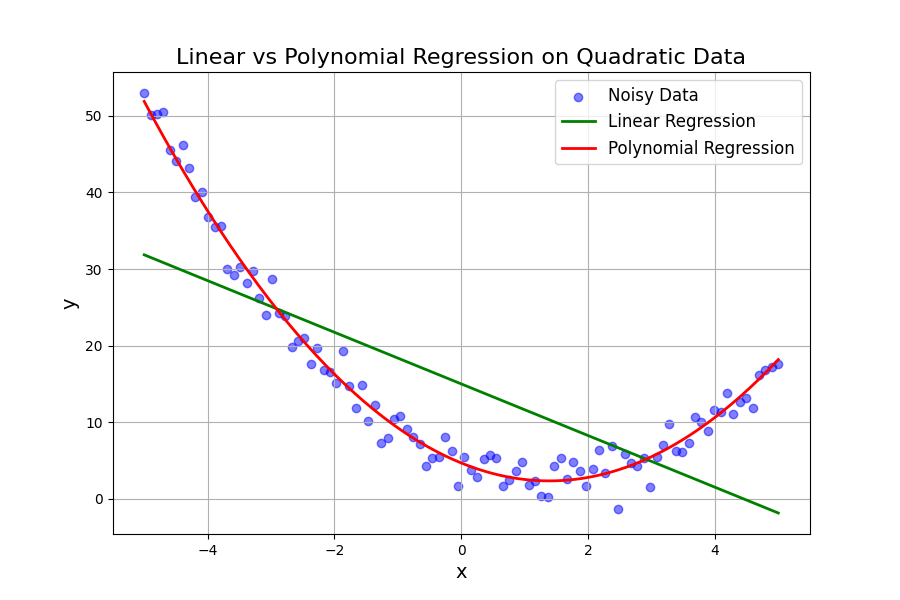
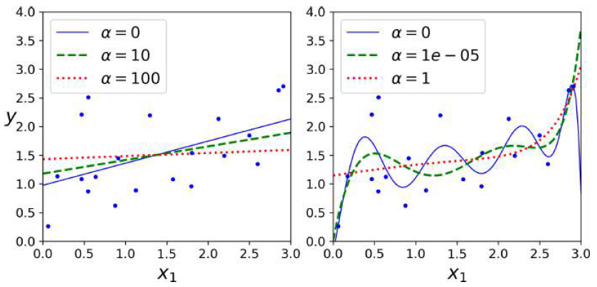

# Week-03: Polynomial Regression, Bias-Variance Tradeoff, and Regularization

## Polynomial Regression

Real-world data often exhibits more complex patterns than can be captured by a simple straight line. Surprisingly, we can still use a linear model to fit nonlinear data through an approach called Polynomial Regression. The fundamental idea involves adding powers of each feature as new features, then training a linear model on this extended feature set. This technique allows linear models to capture nonlinear relationships while maintaining the computational benefits of linear regression.

## How Polynomial Regression Works

With Polynomial Regression, we can model complex relationships by including higher-order terms of our features. For example, with a single feature, the model can include squared, cubed, or even higher powers of that feature. 

```math

y \approx \theta_0 + \theta_1 x + \theta_2 x^2 + \theta_3 x^3 + \dots

```

What makes this approach particularly powerful is that while the relationship between features and target becomes nonlinear, the model remains linear in its parameters. This means we can still use the same optimization techniques as in linear regression, but with increased flexibility to capture curved patterns in the data.

## Polynomial Regression with Multiple Features

When working with multiple features, Polynomial Regression becomes even more powerful as it can capture interactions between different features. Modern machine learning libraries like Scikit-Learn provide tools such as the PolynomialFeatures class that automatically generates all polynomial combinations of features up to a specified degree. This includes not only individual feature powers but also cross-terms that represent interactions between features. The resulting model is significantly richer and more expressive than plain Linear Regression, capable of modeling complex multidimensional relationships.

## Linear vs Polynomial Regression

The choice between linear and polynomial regression depends on the underlying structure of the data. Linear regression works well when the relationship between features and target is approximately linear, but it tends to underfit when faced with curved patterns. Polynomial regression, by contrast, can capture these curvatures more effectively. However, this increased flexibility comes with the risk of overfitting if the polynomial degree becomes too high, highlighting the importance of finding the right model complexity.

 
Figure: Comparison showing linear model underfitting quadratic data while polynomial regression captures the curvature effectively

## Learning Curves

Learning curves provide valuable diagnostic tools for understanding model behavior by plotting both training error and validation error as the number of training examples increases. These curves help identify whether a model is underfitting or overfitting. 

**Underfitting** manifests as both training and validation errors remaining high and close to each other, indicating the model is too simple to capture the underlying patterns. 

**Overfitting**, on the other hand, appears as training error becoming very small while validation error remains high, with a significant gap between the two curves. Analyzing learning curves helps guide decisions about whether to use more complex models, gather additional data, or adjust regularization parameters.

## Bias, Variance, and Irreducible Error

Understanding model performance requires considering three fundamental sources of error: bias, variance, and irreducible error. Bias represents error due to incorrect assumptions about the data, such as assuming a linear relationship when the true relationship is quadratic. High bias typically leads to underfitting. Variance, conversely, refers to error caused by the model's sensitivity to small fluctuations in the training data, with high variance leading to overfitting. Irreducible error stems from inherent noise in the data itself and can only be reduced by improving data quality through methods like fixing measurement instruments or removing outliers.

## The Bias-Variance Tradeoff

The bias-variance tradeoff represents a fundamental challenge in machine learning. As model complexity increases, variance tends to increase while bias decreases, creating risk of overfitting. Conversely, reducing model complexity decreases variance but increases bias, risking underfitting. The goal is to find the optimal balance where the combined effect of bias and variance minimizes the total generalization error. This tradeoff underscores why neither extremely simple nor extremely complex models typically perform best, and why careful model selection is crucial.

## Regularized Linear Models

Regularization provides a powerful technique for reducing overfitting by constraining model complexity. The core idea involves limiting the model's degrees of freedom, making it harder for the model to overfit to noise in the training data. In polynomial regression, this might mean reducing the polynomial degree. For linear models, regularization is typically achieved by constraining the weight parameters. Several regularization approaches exist, with Ridge Regression, Lasso Regression, and Elastic Net being among the most commonly used methods for linear models.

## Ridge Regression

Ridge Regression, also known as Tikhonov regularization, introduces a penalty term to the standard linear regression cost function that encourages smaller weight values. 

```math

J(\theta) = \text{MSE}(\theta) + \alpha \frac{1}{2} \sum_{i=1}^{n} \theta_i^2

```

This penalty term is proportional to the sum of squared weights, which has the effect of shrinking the coefficients toward zero without eliminating them entirely. Importantly, the bias term is typically not regularized. The strength of regularization is controlled by a hyperparameter **$\alpha$**, where setting **$\alpha$** to zero gives ordinary linear regression, while large **$\alpha$** values push weights toward zero, resulting in predictions that approach the mean of the target variable.

## Ridge Regression – Training Notes

When implementing Ridge Regression, it's important to distinguish between the cost function used during training and the evaluation metric used for testing. During training, the regularization term is included to guide the optimization process, while during testing, standard performance measures like **mean squared error** are used without the regularization component. 

For gradient descent optimization, the regularization affects the gradient calculation. 

```math

\nabla J(\theta) = \nabla \text{MSE}(\theta) + \alpha \theta

```

Additionally, feature scaling becomes particularly important in Ridge Regression since the regularization penalty treats all weights equally, making features with different scales contribute disproportionately to the penalty term.

## Ridge Regression – Effect of $\alpha$

The **$\alpha$** hyperparameter in Ridge Regression controls the tradeoff between fitting the training data and keeping model weights small. As **$\alpha$**increases, the model predictions become flatter and less extreme, reducing variance at the cost of increased bias. 

This demonstrates the bias-variance tradeoff in action: larger **$\alpha$** values reduce model variance but increase bias, while smaller **$\alpha$** values allow the model to fit the training data more closely but with higher variance. The optimal **$\alpha$** value typically lies somewhere between these extremes.

 
Figure: Ridge regression with different alpha values showing how increasing alpha makes predictions flatter

## Lasso Regression

Lasso Regression takes a different approach to regularization by using the sum of absolute values of the weights as the penalty term. 

```math

J(\theta) = \text{MSE}(\theta) + \alpha \sum_{i=1}^n |\theta_i|

```

This **L1** penalty has the important property that it tends to drive some weights exactly to zero, effectively performing automatic feature selection. The resulting models are sparse, meaning they use only a subset of the available features. 

Like Ridge Regression, Lasso uses an $\alpha$ hyperparameter to control regularization strength, with larger alpha values forcing more weights to zero and creating sparser models.

## Elastic Net

Elastic Net combines the benefits of both Ridge and Lasso regression by including both L1 and L2 penalty terms in the cost function. 

```math

J(\theta) = \text{MSE}(\theta) 
+ r \alpha \sum_{i=1}^n |\theta_i|
+ \frac{1-r}{2} \alpha \sum_{i=1}^n \theta_i^2

```

This hybrid approach includes a mixing ratio **$r$** parameter that determines the balance between the two penalty types. Setting this ratio to zero gives pure Ridge Regression, while setting it to one gives pure Lasso Regression. 

Elastic Net is particularly useful when the number of features exceeds the number of training instances or when features are strongly correlated, situations where Lasso can behave unpredictably.

## Week-03 Summary

This week covered several crucial concepts in machine learning model development. We explored the fundamental challenge of underfitting versus overfitting, where underfitting occurs when models are too simple and have high bias, while overfitting happens when models are too complex and have high variance. Learning curves provide diagnostic tools to identify these conditions by comparing training and validation errors. Regularization techniques including Ridge Regression, Lasso Regression, and Elastic Net offer systematic approaches to control model complexity and reduce overfitting. The key insight is that appropriate regularization improves model generalization and typically produces better performance on unseen data compared to unregularized models.