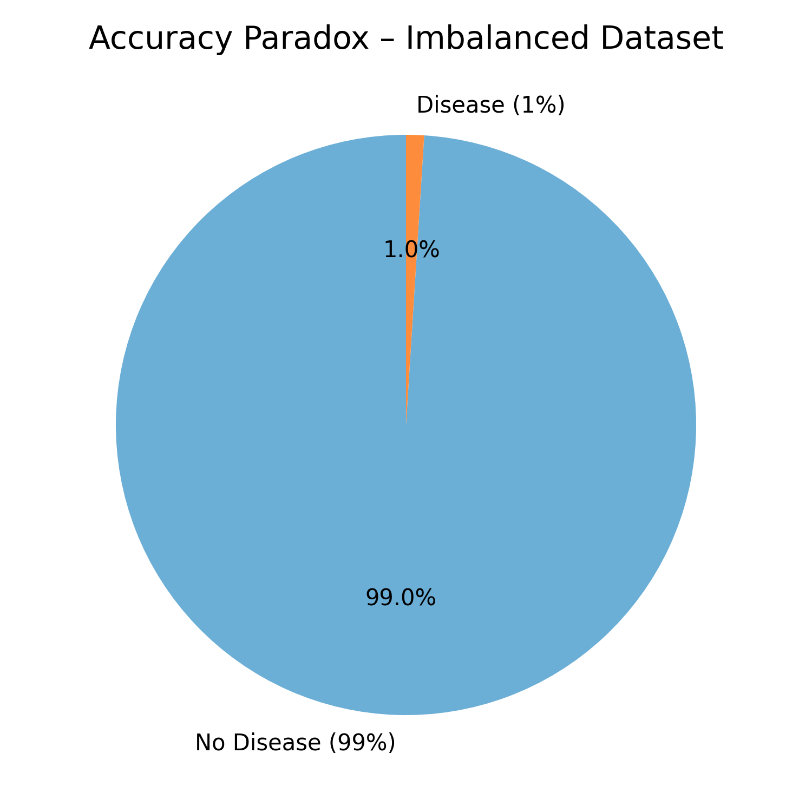
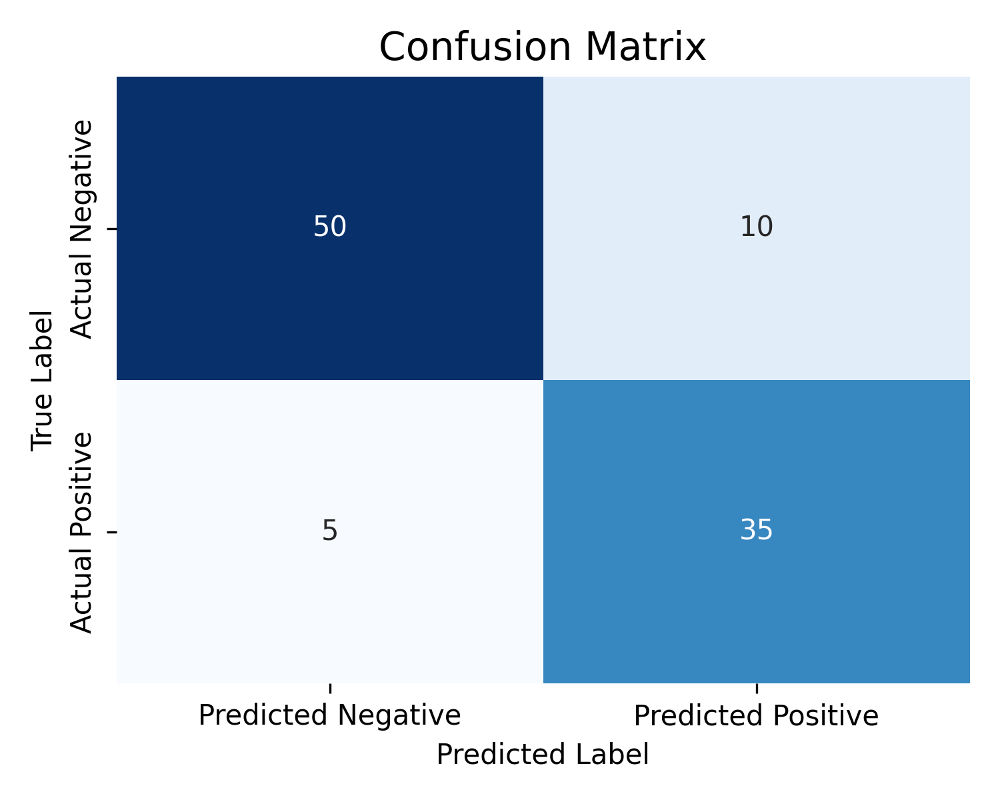
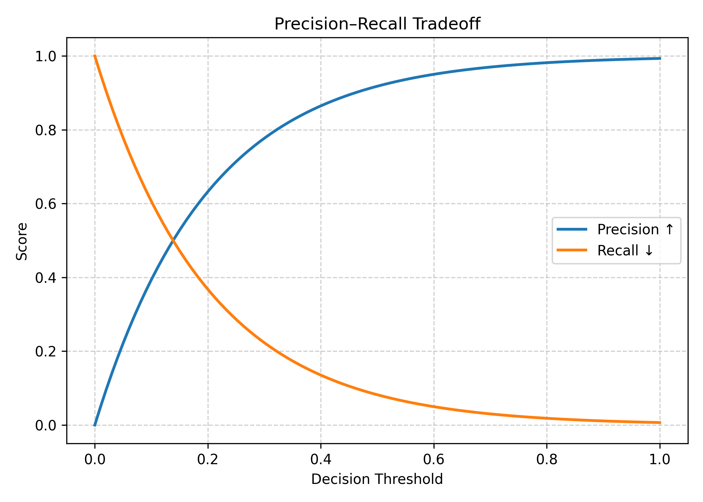
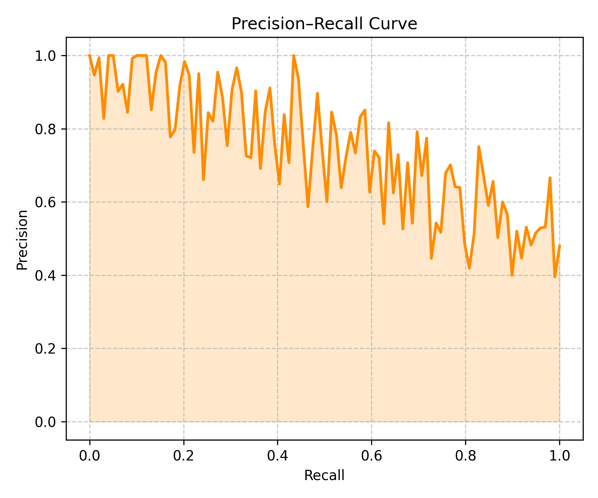
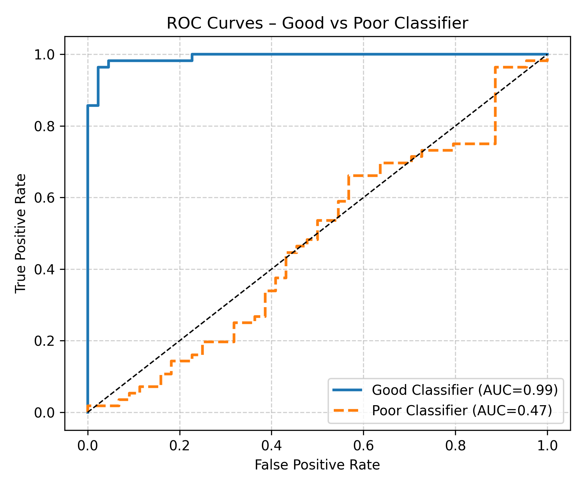
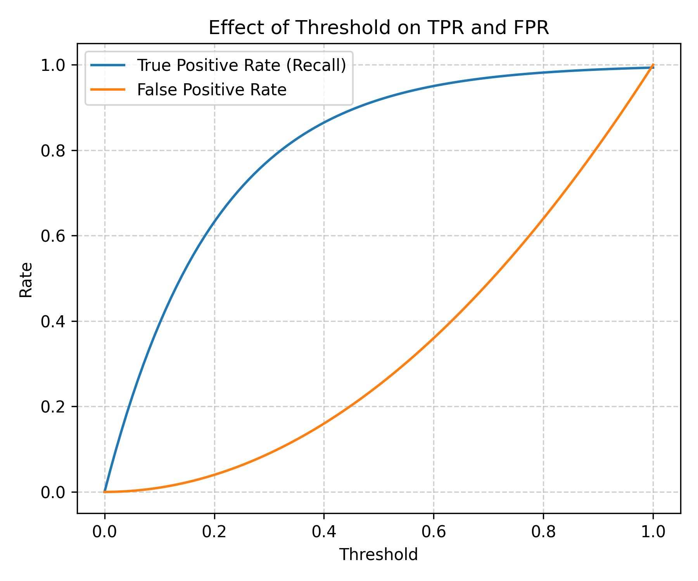

# Week 05 — Classification Metrics

## 1. Introduction

Evaluating the performance of a machine learning model is as important as building it. A good evaluation metric helps us understand how well our model generalizes to unseen data and whether it makes the right kind of predictions. In classification tasks, the most intuitive metric we often start with is **accuracy** — the ratio of correctly predicted instances to the total number of instances. However, as we will soon discover, accuracy is not always a reliable indicator of true performance, especially in cases where the dataset is imbalanced.

---

## 2. Understanding Accuracy and Its Limitations

Accuracy is defined as:

```math
\text{Accuracy} = \frac{\text{Number of Correct Predictions}}{\text{Total Number of Predictions}} = \frac{TP + TN}{TP + TN + FP + FN}
```

where **TP**, **TN**, **FP**, and **FN** represent True Positives, True Negatives, False Positives, and False Negatives respectively.

While this seems like a natural and simple measure of performance, it can be misleading in scenarios where one class heavily dominates the other. For example, imagine a medical diagnosis model where only 1% of patients actually have a rare disease. If the model simply predicts *“no disease”* for everyone, it would be **99% accurate** — yet completely useless for identifying actual patients who need help.



This phenomenon is known as the **accuracy paradox**, and it motivates the need for more robust metrics that take into account the nature of misclassifications.

---

## 3. The Confusion Matrix

To understand model performance more deeply, we use the **confusion matrix**. It provides a detailed breakdown of the model’s predictions and allows us to see where it is making mistakes.

| Actual / Predicted | Positive | Negative |
|--------------------|-----------|-----------|
| **Positive**       | True Positive (TP) | False Negative (FN) |
| **Negative**       | False Positive (FP) | True Negative (TN) |



Each term has a specific meaning:

- **True Positive (TP):** Correctly predicted positive cases.
- **True Negative (TN):** Correctly predicted negative cases.
- **False Positive (FP):** Incorrectly predicted as positive (Type I error).
- **False Negative (FN):** Missed actual positive (Type II error).

The confusion matrix helps visualize how predictions are distributed across classes and provides the foundation for defining all other classification metrics.

---

## 4. Precision and Recall

Two of the most important metrics derived from the confusion matrix are **Precision** and **Recall**. They focus on the performance of the positive (or minority) class, which is often of greatest interest.

### Precision

Precision measures how many of the predicted positives are actually correct:

\[
\text{Precision} = \frac{TP}{TP + FP}
\]

It answers the question:  
> “When the model predicts positive, how often is it correct?”

High precision means the model makes few false positive errors.

### Recall

Recall (also known as **Sensitivity** or **True Positive Rate**) measures how many of the actual positives were correctly identified:

```math
\text{Recall} = \frac{TP}{TP + FN}
```

It answers the question:  
> “Of all the actual positives, how many did the model detect?”

High recall means the model misses very few positive cases.

---

## 5. The Precision–Recall Tradeoff

In many models (especially probabilistic ones like logistic regression), predictions are made by comparing the predicted probability to a threshold — typically 0.5. Changing this threshold can significantly affect precision and recall.



- Lowering the threshold increases recall (more positives are detected), but precision drops since more false positives occur.
- Raising the threshold increases precision (fewer false alarms) but reduces recall (more true cases are missed).

The ideal balance between precision and recall depends on the application.  
For example:
- In **spam filtering**, we prefer **high precision** to avoid marking important emails as spam.
- In **medical screening**, we prefer **high recall** to avoid missing actual patients with disease.

---

## 6. The Precision–Recall Curve

To visualize this tradeoff, we can plot the **Precision–Recall curve**.  
This curve shows precision on the y-axis and recall on the x-axis as the decision threshold varies.



A perfect classifier would have precision and recall both equal to 1, resulting in a point at the top-right corner.  
In practice, the area under this curve (AUC-PR) provides a single number summarizing performance — higher values indicate better performance.

The precision–recall curve is especially useful for **imbalanced datasets**, where the number of negative cases far exceeds the positive ones, since it focuses only on the performance of the positive class.

---

## 7. F1-Score: Balancing Precision and Recall

Sometimes, we need a single metric that combines both precision and recall.  
The **F1-score** provides such a harmonic mean:

```math
F1 = 2 \times \frac{\text{Precision} \times \text{Recall}}{\text{Precision} + \text{Recall}}
```

The harmonic mean penalizes extreme values — a classifier with high precision but low recall (or vice versa) will have a modest F1-score.  
This makes the F1-score particularly useful when you need to balance between identifying positives and avoiding false alarms.

---

## 8. ROC Curve (Receiver Operating Characteristic)

While Precision–Recall curves are useful for imbalanced data, the **ROC Curve** provides a more general view of classification performance.

The ROC curve plots:

- **True Positive Rate (TPR)** on the y-axis  
  
  ```math
  TPR = \frac{TP}{TP + FN}
  ```
- 
**False Positive Rate (FPR)** on the x-axis  

```math
  FPR = \frac{FP}{FP + TN}
```



Each point on the ROC curve corresponds to a different classification threshold.  
A model that makes random guesses will produce a diagonal line from (0, 0) to (1, 1).  
The closer the curve is to the top-left corner, the better the classifier.

---

## 9. AUC – Area Under the ROC Curve

The **AUC (Area Under the Curve)** provides a single scalar value summarizing the ROC curve.  
It can be interpreted as the probability that the classifier ranks a randomly chosen positive instance higher than a randomly chosen negative one.

- **AUC = 1.0** → Perfect classifier  
- **AUC = 0.5** → Random classifier (no discriminative power)

AUC is particularly valuable when comparing multiple models — the one with higher AUC generally performs better across all thresholds.

---

## 10. Choosing the Right Metric

No single metric fits all classification problems.  
The choice depends on your data distribution and the cost of different types of errors:

| Scenario | Recommended Metric |
|-----------|-------------------|
| Balanced classes | Accuracy |
| Imbalanced classes | Precision, Recall, F1-score |
| Ranking/class probabilities | ROC-AUC |
| Focused on positive class | Precision–Recall or F1-score |

In practical ML workflows, you should always start by examining the **confusion matrix** and then consider multiple metrics to get a complete picture of model behavior.

---

## 11. Summary

This week’s lecture focused on evaluating classification models.  
We started with accuracy and learned why it can be deceptive in imbalanced datasets. We introduced the confusion matrix as a foundation for understanding prediction errors and explored precision, recall, and their tradeoff through intuitive examples. We then discussed F1-score as a harmonic mean of precision and recall and concluded with ROC curves and AUC as comprehensive tools for assessing classifier performance.



By understanding and applying these metrics thoughtfully, we can make more informed choices when tuning models and selecting the most appropriate one for deployment.

---

**Source:**  
A. Géron, *Hands-On Machine Learning with Scikit-Learn, Keras, and TensorFlow*, O’Reilly Media.
