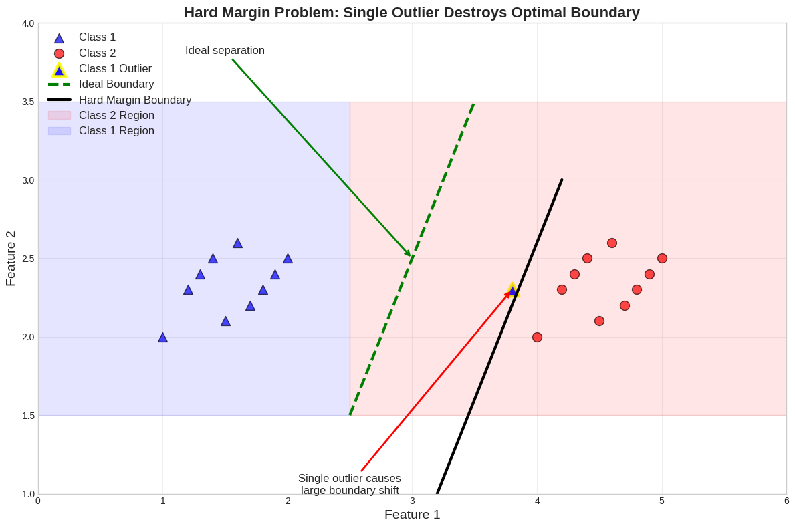

# Week 06 - Support Vector Machines (SVM)

This week, we will develop both an intuitive and mathematical understanding of Support Vector Machines (SVMs) — one of the most powerful and versatile algorithms in machine learning. 

---

## 1. Introduction to Support Vector Machines

Support Vector Machines (SVMs) are supervised learning models that find the best possible boundary between classes. Unlike simple classifiers that just separate data, SVMs aim to find the optimal separating hyperplane — the one that maximizes the distance (called the margin) between itself and the nearest data points from each class.

The **intuition** is straightforward: among all possible boundaries that separate the classes, we want the one that keeps the largest **safety buffer** between the two. This margin-based approach gives SVMs strong generalization capabilities.


Figure: Example of Binary Classification using Mamimum Margin

## 2. Why Maximize the Margin?

Imagine driving along a wide road versus a narrow alley. On the wide road, there’s less chance of bumping into obstacles, even if you slightly drift. Similarly, an SVM aims to position the decision boundary as far away as possible from any data point of either class. This buffer zone — **the margin** — acts as a confidence region.

A larger margin in a Support Vector Machine generally leads to more robust and reliable predictions, as the model becomes less sensitive to small variations or noise in the training data. This wider separation between classes tends to improve the model’s ability to perform well on unseen data, enhancing its generalization capability. By maintaining a larger margin, the risk of overfitting is reduced because the model focuses on the overall structure of the data rather than trying to perfectly classify every training point. On the other hand, if the decision boundary is positioned too close to the data points, it may fit the training examples very accurately but fail to generalize to new samples, resulting in poor performance on test data.

## 3. Hard Margin Classification

In an ideal scenario where data is perfectly linearly separable, we can draw a straight line (in 2D) or a hyperplane (in higher dimensions) that cleanly separates the two classes. This is known as the **Hard Margin SVM**.

The goal is to find the hyperplane that maximizes the margin while ensuring every point is correctly classified. 

Mathematically, if we denote a hyperplane by its weight vector w and bias b, the constraints for correctly classified data are:

```math
y_i (w^\top x_i + b) \ge 1 \quad \forall i
```
We want to maximize the margin, which is equivalent to minimizing the norm of the weight vector:

```math
\min_{w, b} \ \frac{1}{2} \| w \|^2
```

Points that lie exactly on the margin boundaries are called **support vectors** — they are the “critical” points that define the decision boundary. Removing any non-support vector does not affect the hyperplane.


Figure: Support Vectors defining the Margin

## 4. Limitations of Hard Margin SVM

Although elegant in theory, hard margin SVMs fail in practical situations. Real-world data is noisy, often overlapping, and rarely perfectly separable. A single outlier can shift the decision boundary significantly, resulting in poor generalization.


Figure: Hard Margin Classification Problems with Outliers

To address this, we introduce a **soft margin**, which allows a few misclassifications in exchange for a wider, more robust margin.


## 5. Soft Margin SVM

The Soft Margin SVM modifies the optimization problem by introducing slack variables $\xi_i$ (xi) that allow some points to fall inside the margin or even on the wrong side of the boundary. The optimization now balances two goals:

- Maximizing the margin (keeping w small)

- Minimizing classification errors (keeping $\xi_{i}$ small)

This is controlled by a regularization parameter **$C$**, leading to the following optimization:


A large value of **$C$** imposes a heavy penalty on misclassification, resulting in a narrow margin and potentially overfitting. A small **$C$** allows more flexibility (wider margin) but might underfit.


Figure: Effect of C on margin width and misclassification

## 6. Non-Linear SVMs

Many real-world problems cannot be separated by a straight line. For example, circular or spiral data distributions require more complex boundaries.

In such cases, the SVM can still be applied by mapping the data to a higher-dimensional feature space where linear separation becomes possible. This process is known as **feature mapping** or **non-linear transformation**.


(Figure: Non-linear separable data — nonlinear_data.png)

Figure: Non-linear seperable data example

For instance, mapping a 1D feature x to a 2D feature vector $(x, x^2)$ allows us to separate classes that were previously inseparable in 1D space.


Figure: Feature Mapping from 1D to 2D for classification

## 7. The Kernel Trick

Explicitly transforming data into higher dimensions can be computationally expensive. The kernel trick provides a powerful shortcut for providing higher dimensional transformed data instead of computing the transformation directly. 

Common kernel functions include:

Linear Kernel:


Polynomial Kernel:


Radial Basis Function (RBF) Kernel:


Here, $\gamma$ (gamma) determines how much influence a single training point has — small $\gamma$ values produce smoother decision boundaries, while large $\gamma$ values create more complex, tighter boundaries.

(Figure: Illustration of RBF similarity mapping — rbf_similarity.png)

Figure: Illustration of RBF similarity mapping for classification

## 8. SVM for Regression (SVR)

Support Vector Regression (SVR) applies the same geometric principles of SVM to continuous-valued outputs. Instead of finding a boundary that separates classes, SVR fits a function that approximates the target variable while maintaining a margin of tolerance.

The core idea is the **$\epsilon$-insensitive tube**: errors smaller than $\epsilon$ are ignored, and only deviations beyond this tube are penalized. Mathematically, the optimization problem becomes:

(Figure: $\epsilon$-insensitive tube in SVR — svr_basic.png)


The parameters $\epsilon$ and **$C$** work together:

- A larger $\epsilon$ allows a simpler, smoother function (less sensitive to small variations).

- A smaller $\epsilon$ enforces tighter fitting.

- **$C$** again controls the trade-off between flatness and penalizing errors beyond the $\epsilon$ margin.


## Summary and Practical Advice

SVMs are powerful and flexible models that can handle linear and non-linear problems efficiently through the use of kernels. The margin-based optimization ensures robust generalization, and support vectors provide a sparse representation of the data — only the most critical points matter.

To summarize:

- Margin is key: SVM seeks the boundary with the largest margin.

- Soft margins handle real-world noise effectively.

- Kernels make SVMs flexible for complex, non-linear tasks.

- Parameter tuning is essential for achieving optimal performance.

- Support vectors provide model interpretability and efficiency.

- SVR extends the same principles to regression problems.


In practice:

- Start with a linear SVM for simple data.

- Use an RBF kernel for more complex boundaries.

- Tune **$C$**, $\gamma$, and $\epsilon$ using cross-validation.

- Always visualize decision boundaries when possible to interpret model behavior.

