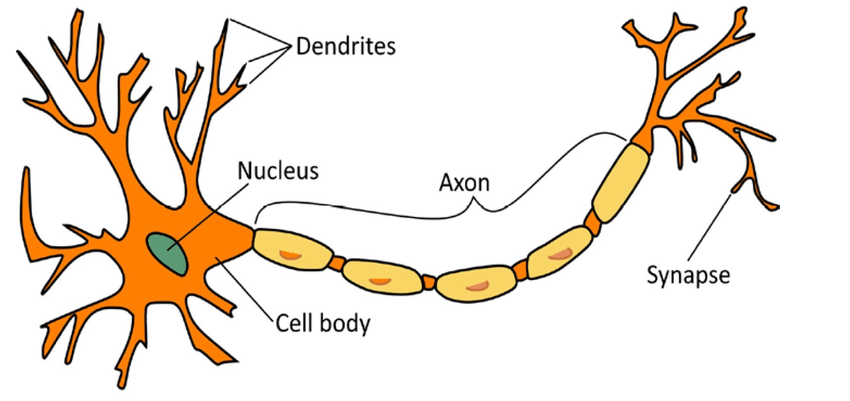
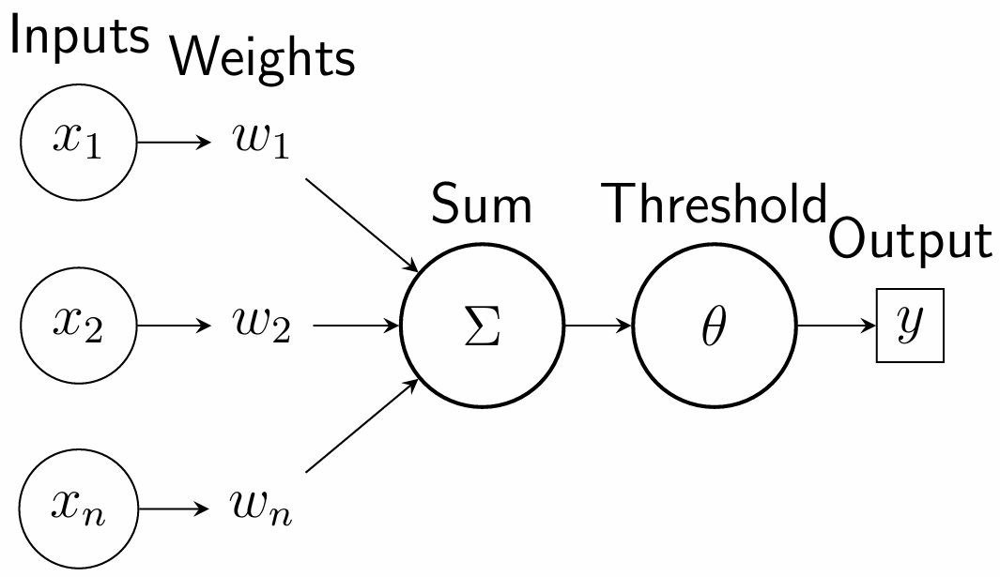
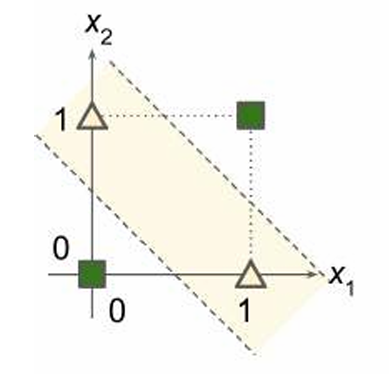
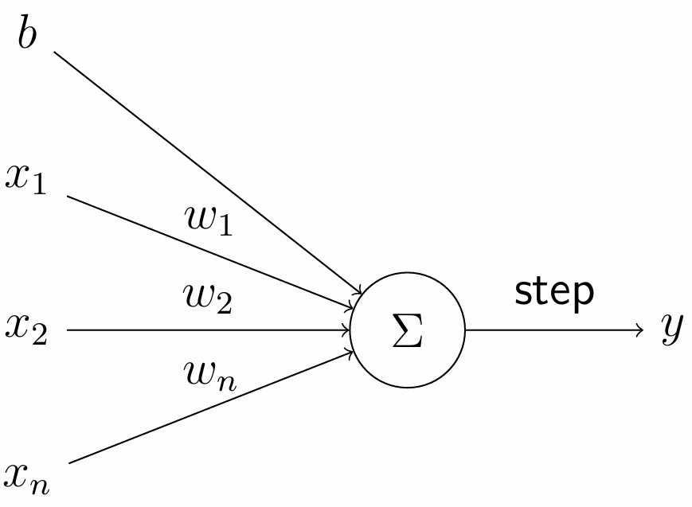
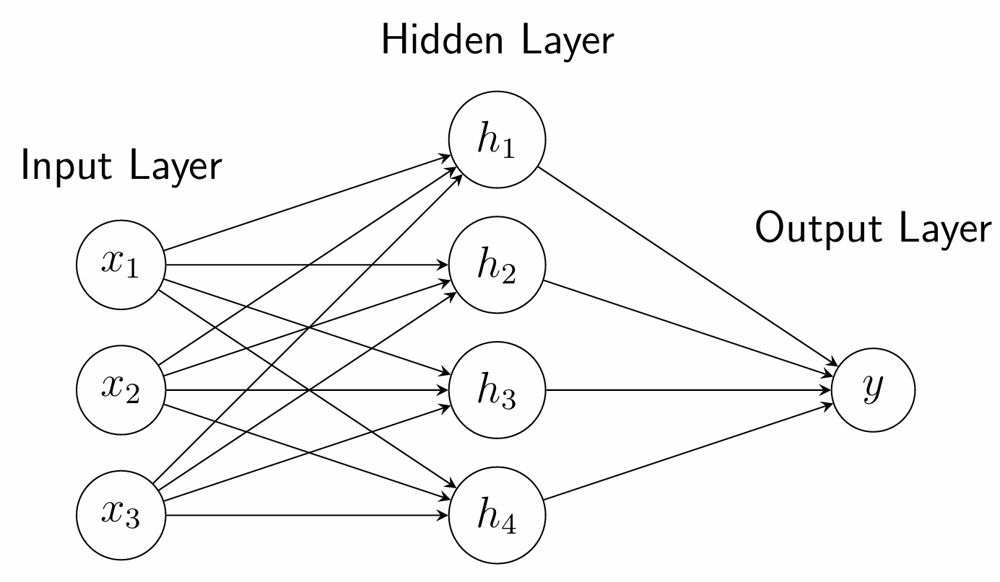
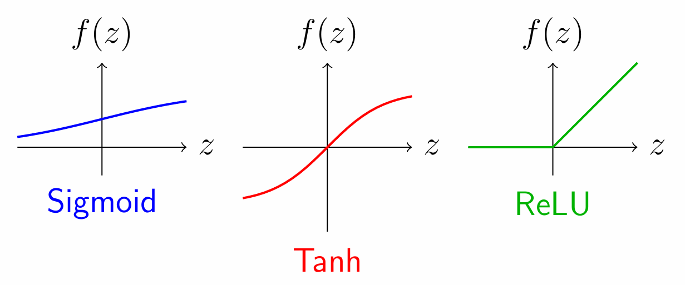
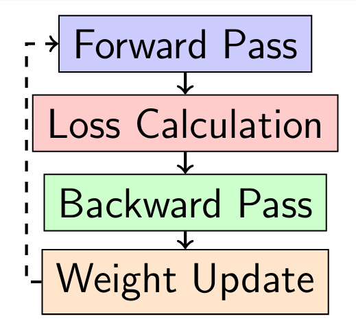

# Introduction to Neural Networks

## Table of Contents
1. [Biological Inspiration](#biological-inspiration)
2. [Early Neural Models](#early-neural-models)
3. [The Perceptron](#the-perceptron)
4. [AI Winters](#ai-winters)
5. [Multi-Layer Networks](#multi-layer-networks)
6. [Activation Functions](#activation-functions)
7. [How Neural Networks Learn](#how-neural-networks-learn)
8. [Modern Deep Learning](#modern-deep-learning)
9. [Conclusion](#conclusion)

## Biological Inspiration

### The Biological Neuron
The human brain serves as the fundamental inspiration for artificial neural networks. Biological neurons consist of several key components. Dendrites act as input receptors that receive electrical signals from other neurons. The cell body, or soma, functions as the processing unit that sums all incoming signals. The axon serves as the output cable that transmits signals to other neurons. Synapses are the connections between neurons that can strengthen or weaken over time, allowing for learning and adaptation in biological systems.


Figure: Components of a Biological Neuron

The core principle borrowed from biological neurons is the weighted sum and threshold mechanism. This means that some neural connections are stronger than others, giving their signals more influence on whether the neuron fires or remains inactive. This biological concept directly inspired the mathematical operations performed by artificial neurons in neural networks.

## Early Neural Models

### McCulloch-Pitts Neuron (1943)
The McCulloch-Pitts neuron represents the first mathematical model of a biological neuron, developed by neuroscientist Warren McCulloch and logician Walter Pitts. This pioneering work established the foundational concepts for artificial neural networks. The model uses binary inputs and outputs, processing information as either 0 or 1 values. It implements a simple threshold activation function that determines when the neuron should fire based on input signals. The system features fixed weights with excitatory connections represented by +1 and inhibitory connections by -1. All neurons operate synchronously, processing information in coordinated time steps. Despite its simplicity, this model can compute basic logical functions that form the building blocks of more complex computations.


Figure: Mcculloch-Pitts Neuron Model

```math

% McCulloch-Pitts Neuron
Output = 
\begin{cases}
1 & \text{if } \sum_{i=1}^n w_i x_i \geq \theta \\
0 & \text{otherwise}
\end{cases}

```

However, the McCulloch-Pitts neuron has significant limitations. It lacks any learning mechanism, requiring all weights and thresholds to be set manually by designers. This manual configuration severely limits its computational capability and practical applications, as it cannot adapt to new information or learn from experience.


### Logic Gate Implementation
The McCulloch-Pitts neuron demonstrates its computational capabilities by implementing basic logical operations. The AND gate requires both inputs to be active (value 1) for the output to become active, effectively detecting when all conditions are met simultaneously. The OR gate activates when at least one input is active, serving as a detector for when any condition is satisfied. The NOT gate inverts the input signal, transforming active inputs to inactive outputs and vice versa, using inhibitory connections to achieve this logical negation.

**AND Gate:**
- Requires both inputs to be 1 for output to be 1
- Implemented with weights of +1 and threshold of 2

```math

% AND Gate
y = 
\begin{cases}
1 & \text{if } x_1 + x_2 \geq 2 \\
0 & \text{otherwise}
\end{cases}

```

**OR Gate:**
- Requires at least one input to be 1 for output to be 1
- Implemented with weights of +1 and threshold of 1

```math

% OR Gate
y = 
\begin{cases}
1 & \text{if } x_1 + x_2 \geq 1 \\
0 & \text{otherwise}
\end{cases}
```

**NOT Gate:**
- Inverts the input signal
- Uses inhibitory connection with weight of -1 and threshold of 0

```math

% NOT Gate
y = 
\begin{cases}
1 & \text{if } -x \geq 0 \\
0 & \text{otherwise}
\end{cases}

```

### The XOR Problem
A critical limitation emerged when attempting to implement the Exclusive OR (XOR) function using single-layer networks. The XOR function produces distinctive output patterns where the output is active only when the inputs differ from each other. The fundamental problem arises because no single straight line can separate the different output classes in the XOR problem space. This geometric limitation means that single-layer perceptrons cannot learn or represent the XOR function, as they can only solve problems that are linearly separable. The solution to this limitation requires multiple layers of processing, where a hidden layer computes intermediate functions that are then combined to produce the final XOR output.


Figure: The XOR Problem

**XOR Truth Table:**
- (0,0) → 0
- (0,1) → 1
- (1,0) → 1
- (1,1) → 0


## The Perceptron

### Frank Rosenblatt's Perceptron (1958)
The perceptron introduced revolutionary learning capabilities to artificial neurons, marking a significant advancement over earlier models. This was the first learnable artificial neuron model that could adapt its behavior based on experience. Unlike previous models, it uses real-valued inputs and weights, allowing for more nuanced representations of information. The inclusion of a bias term provides additional flexibility in decision-making processes. The model employs a step function activation that produces binary outputs based on whether the weighted sum exceeds a threshold.


Figure: Frank Rosenblatt's Perceptron Model

The architecture consists of multiple input nodes with associated weights that determine the importance of each input. A summation unit computes the weighted sum of inputs plus a bias term. Finally, a step function processes this sum to produce the final binary output decision.

```math

\begin{align}

z = \sum_{i=1}^n w_i x_i + b \\
\text{output} = \text{step}(z)

\end{align}

```

### Perceptron Learning Algorithm
The perceptron learns through an iterative process that adjusts its parameters based on performance. The process begins with initialization, where small random values are assigned to weights and bias to break symmetry. During prediction, the network processes each training example to compute an output. Error calculation then compares this prediction with the true label to determine how wrong the network was. Weight update follows, where weights are adjusted proportionally to both the error and the corresponding input values. Similarly, the bias update modifies the bias term based on the error magnitude.

The learning rate parameter controls how quickly the weights change during training, balancing between rapid learning and stable convergence. Typical values provide moderate adjustment speeds that allow for effective learning without overshooting optimal solutions.

The perceptron demonstrates several key capabilities in its operation. It can learn fundamental logical operations including AND, OR, and NOT gates through appropriate weight configurations. The model creates linear decision boundaries that separate different classes in the input space. Most importantly, it can solve any problem that is linearly separable, meaning classes can be divided by a single straight line or hyperplane.

## AI Winters

### The First AI Winter (1970s-1980s)
The initial enthusiasm for neural networks faced a major setback due to fundamental theoretical limitations. Marvin Minsky and Seymour Papert's influential book "Perceptrons" provided rigorous mathematical proof of the perceptron's limitations. Their work demonstrated conclusively that single-layer perceptrons cannot solve non-linearly separable problems like the XOR function. This revelation led to widespread pessimism throughout the research community about the potential of neural networks.

The consequences were severe and long-lasting. Research funding saw drastic reductions as confidence in the field diminished. The AI community shifted its focus toward symbolic AI approaches that seemed more promising at the time. Neural network research was largely abandoned for over a decade, representing a significant setback in the development of artificial intelligence.

### The Second AI Winter (Late 1990s - Early 2000s)
Even with the development of multi-layer networks, significant challenges persisted that limited practical applications. Technical challenges included limited computational power that made training deep networks prohibitively slow. Insufficiently large datasets prevented networks from learning complex patterns effectively. The vanishing gradient problem made learning in deep networks extremely difficult. Meanwhile, competition emerged from simpler, more interpretable models like Support Vector Machines that often performed better on practical problems.

The impact of these challenges was substantial. Funding and interest in neural networks reached low levels as researchers pursued alternative approaches. The focus shifted toward more theoretically grounded methods that offered better understood properties. Neural networks were generally considered impractical for most real-world applications during this period.

## Multi-Layer Networks

### Multi-Layer Perceptrons (MLPs)
Multi-layer networks provided the architectural solution to the limitations of single-layer perceptrons. The network architecture organizes processing into distinct layers with specialized functions. The input layer receives and distributes the raw data to the network. Hidden layers perform intermediate processing and feature extraction, transforming inputs into more useful representations. The output layer produces the final prediction or classification based on the processed information.


Figure: Multi-Layer Perceptrons (MLPs) Network

The key insight behind multi-layer networks is that stacking multiple layers enables learning of complex, hierarchical features. Each layer builds upon the representations learned by previous layers, allowing the network to model increasingly sophisticated patterns through this compositional approach.

**Mathematical Operations:**
The forward pass through a multi-layer network involves:

**Layer 1 (Input to Hidden):**

Compute weighted sum of inputs to hidden layer

```math
\begin{align}

z_1^{[1]} &= w_{11}^{[1]}x_1 + w_{12}^{[1]}x_2 + w_{13}^{[1]}x_3 + b_1^{[1]} \\
z_2^{[1]} &= w_{21}^{[1]}x_1 + w_{22}^{[1]}x_2 + w_{23}^{[1]}x_3 + b_2^{[1]} \\
z_3^{[1]} &= w_{31}^{[1]}x_1 + w_{32}^{[1]}x_2 + w_{33}^{[1]}x_3 + b_3^{[1]} \\
z_4^{[1]} &= w_{41}^{[1]}x_1 + w_{42}^{[1]}x_2 + w_{43}^{[1]}x_3 + b_4^{[1]}

\end{align}

```

Apply an activation function, such as ```ReLU``` to each hidden neuron

```math
\begin{align}

a_1^{[1]} &= \max(0, z_1^{[1]}) \\
a_2^{[1]} &= \max(0, z_2^{[1]}) \\
a_3^{[1]} &= \max(0, z_3^{[1]}) \\
a_4^{[1]} &= \max(0, z_4^{[1]})

\end{align}

```

**Layer 2 (Hidden to Output):**

Likewise, the weighted sum of hidden layer activations is computed followed by an appropriate activation function, more on this later, that predicts the output of the network 

```math

\begin{align}
z_1^{[2]} &= w_{11}^{[2]}a_1^{[1]} + w_{12}^{[2]}a_2^{[1]} + w_{13}^{[2]}a_3^{[1]} + w_{14}^{[2]}a_4^{[1]} + b_1^{[2]} \\
a_1^{[2]} &= f_{output}(z_1^{[2]})
\end{align}

```

**Matrix Form (Efficient Computation):**

```math
\begin{align}

\mathbf{Z}^{[1]} = \mathbf{W}^{[1]}\mathbf{X} + \mathbf{b}^{[1]} \\
\mathbf{A}^{[1]} = \text{ReLU}(\mathbf{Z}^{[1]}) \\
\mathbf{Z}^{[2]} = \mathbf{W}^{[2]}\mathbf{A}^{[1]} + \mathbf{b}^{[2]} \\
\mathbf{A}^{[2]} = f_{output}(\mathbf{Z}^{[2]})

\end{align}
```

## Activation Functions

### The Need for Non-Linearity
Activation functions play a crucial role in enabling the powerful learning capabilities of deep neural networks. The critical mathematical insight is that without non-linear activation functions, any deep network collapses to a single linear layer. This collapse means the network would have no more expressive power than simple linear regression, completely unable to learn the complex relationships present in real-world data.

```math

\mathbf{a}^{[2]} = \mathbf{W}^{[2]}(\mathbf{W}^{[1]}\mathbf{x} + \mathbf{b}^{[1]}) + \mathbf{b}^{[2]} = (\mathbf{W}^{[2]}\mathbf{W}^{[1]})\mathbf{x} + (\mathbf{W}^{[2]}\mathbf{b}^{[1]} + \mathbf{b}^{[2]}) = \mathbf{W}'\mathbf{x} + \mathbf{b}'

```

The power of non-linearity enables several key capabilities in neural networks. It allows learning of complex feature hierarchies where simple features combine to form more complex representations. This enables universal approximation of functions, meaning networks can theoretically learn any continuous relationship. Most importantly, it supports hierarchical feature learning where networks automatically discover relevant features from simple to complex patterns.


### Common Activation Functions

**Sigmoid:**

The sigmoid function produces smooth, bounded outputs between 0 and 1, making it interpretable as probabilities. However, it suffers from the vanishing gradient problem in deep networks, where gradients become extremely small during training.

```math

\sigma(z) = \frac{1}{1 + e^{-z}}

```


**Hyperbolic Tangent (tanh):**

The hyperbolic tangent function produces zero-centered outputs between -1 and 1, which often leads to better training performance. Despite this advantage, it still remains susceptible to vanishing gradients in very deep networks.

```math

\tanh(z) = \frac{e^z - e^{-z}}{e^z + e^{-z}}

```


**Rectified Linear Unit (ReLU):**

The Rectified Linear Unit (ReLU) has become the most commonly used activation function in modern networks due to its computational efficiency and ability to avoid vanishing gradients for positive inputs.

```math

\text{ReLU}(z) = \max(0, z)

```

**ReLU Derivative:**

```math

% ReLU Derivative
\text{ReLU}'(z) = 
\begin{cases}
1 & \text{if } z > 0 \\
0 & \text{if } z \leq 0
\end{cases}

```


Figure: Common Activation Functions

### Output Layer Activation Functions
The choice of output activation function depends entirely on the specific problem type being solved.

**Linear/No Activation:**
Linear or no activation is used for regression problems predicting any real value, such as house prices or temperature readings.

```math

a = z

```

**ReLU:**
ReLU activation suits regression tasks predicting non-negative values like age, salary, or distance measurements.

```math

a = \max(0, z)

```

**Sigmoid:**
Sigmoid activation works for binary classification problems where outputs represent probabilities, such as spam detection or medical diagnosis.

```math

a = \sigma(z) = \frac{1}{1 + e^{-z}}

```

**Softmax:**
Softmax activation handles multi-class classification problems where outputs form a probability distribution over multiple classes, used in applications like digit recognition or object classification.

```math

a_k = \frac{e^{z_k}}{\sum_{j=1}^{C} e^{z_j}}

```

## How Neural Networks Learn

### Backpropagation Algorithm
Backpropagation serves as the fundamental algorithm that enables neural networks to learn effectively from data. The learning process follows a structured sequence of operations. The forward pass computes predictions by propagating input data through the network layers. Loss calculation then measures how wrong these predictions are compared to actual targets. The backward pass calculates gradients using the chain rule to determine how each parameter contributes to the error. Finally, weight update adjusts the network parameters to reduce future errors.

The key insight behind backpropagation's efficiency is that it computes how much each weight contributes to the total error by working backward through the network. This approach reuses computations strategically to avoid redundant calculations, making the learning process computationally feasible even for very large networks.

**The Learning Process:**
1. **Forward Pass**: Compute predictions from input to output
2. **Loss Calculation**: Measure how wrong the predictions are
3. **Backward Pass**: Calculate gradients using chain rule
4. **Weight Update**: Adjust weights to reduce loss


Figure: Neural Networks Training Loop - Repeat Until Convergence

```A complete step-by-step example of the backpropagation algorithm is provided in the lecture slides.```

### Chain Rule and Gradient Computation
The chain rule from calculus provides the mathematical foundation for efficient gradient computation in neural networks. For a simple network, gradients for output layer weights are computed based on prediction error and neuron activations. For hidden layers, gradients depend on errors propagated from subsequent layers combined with activation derivatives from the current layer. This creates a pattern where each layer's gradient computation builds upon results calculated from later layers, establishing an efficient computational flow.

The efficiency of this approach comes from computing gradients backward from output to input layers. This directional computation allows the reuse of intermediate results throughout the process, making gradient calculation efficient even for networks with hundreds or thousands of layers.

### Gradient Descent
Gradient descent provides the optimization mechanism that actually updates network parameters based on computed gradients. The update rule modifies each weight by subtracting a fraction of its gradient, effectively moving parameters in the direction that reduces error. The learning rate parameter controls the size of these adjustment steps during training. If set too small, convergence becomes slow and training takes excessive time. If set too large, the algorithm may overshoot optimal solutions and fail to converge properly. Typical values provide a balance that enables effective learning across various problems.

The training cycle repeats the sequence of forward pass, loss calculation, backward pass, and weight update continuously. This process continues until the network's performance stops improving significantly or reaches an acceptable level for the intended application.

## Modern Deep Learning

### The Renaissance
Several key developments converged to enable the modern deep learning revolution after the AI winter periods. Hardware advances included GPU computing that provided massive parallel processing capabilities essential for training large networks. Specialized AI chips and cloud computing infrastructure further accelerated computational capabilities. Data availability saw dramatic improvements with large-scale labeled datasets like ImageNet becoming available. The big data era provided ample training examples needed for complex models to learn effectively. Algorithmic innovations introduced ReLU activation functions that mitigated the vanishing gradient problem. Advanced regularization techniques like dropout prevented overfitting. Better optimization algorithms like Adam improved training efficiency, while improved weight initialization schemes enabled more stable learning in deep networks.

### Modern Architectures
Different neural network architectures have been developed for specific domains:

**Convolutional Neural Networks (CNNs):**
- Specialized for image processing
- Use spatial hierarchies and parameter sharing
- Applications: computer vision, medical imaging

**Recurrent Neural Networks (RNNs/LSTMs):**
- Designed for sequence data
- Maintain internal state across time steps
- Applications: time series analysis, natural language processing

**Transformers:**
- Use self-attention mechanisms
- Highly parallelizable and scalable
- Foundation for large language models
- Applications: machine translation, text generation

## Conclusion

### Key Takeaways
The development of neural networks represents a fascinating journey through multiple phases of innovation and challenge. From a historical perspective, biological inspiration initially led to the creation of mathematical models that simulated neural processing. Theoretical limitations then caused extended periods of reduced interest known as AI winters. Eventually, architectural and algorithmic advances enabled the modern success and widespread adoption of deep learning.

The technical foundations that enable this success include multi-layer networks with non-linear activations that can learn complex relationships in data. Backpropagation provides the efficient learning mechanism that makes training these networks feasible. Matrix operations allow for parallel computation on modern hardware, dramatically accelerating both training and inference.

### Why Neural Networks Work Now
The success of modern neural networks stems from a convergence of multiple enabling factors working together. Scale has proven crucial, with more data combined with more computational power consistently producing better performance across applications. Architectural understanding has advanced significantly, leading to better network designs and layer types specifically suited to different tasks. Algorithmic advances have improved optimization methods and developed effective regularization techniques that prevent overfitting. Infrastructure development has created powerful software frameworks that simplify implementation, combined with cloud computing and specialized hardware that make large-scale training accessible.

### Current Applications
Neural networks now power numerous real-world applications across diverse domains. Computer vision systems enable self-driving cars to perceive their environment and assist in medical diagnosis through image analysis. Natural language processing facilitates real-time translation between languages and powers conversational AI systems. Recommendation systems personalize user experiences in e-commerce platforms and content streaming services. Scientific discovery benefits from neural networks in fields like drug development and protein folding prediction, accelerating research processes.

The same fundamental principles of weighted sums, non-linear activations, and gradient-based learning continue to drive innovation across all these application domains. This consistency of core concepts, combined with domain-specific architectural innovations, makes neural networks one of the most transformative and widely applicable technologies of our time.