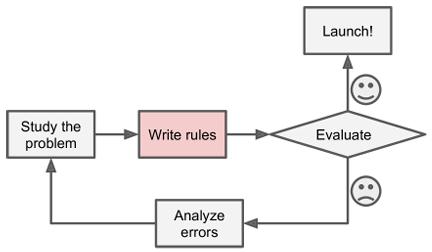
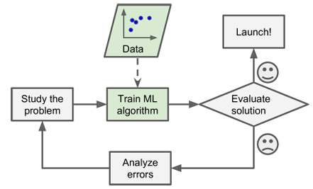
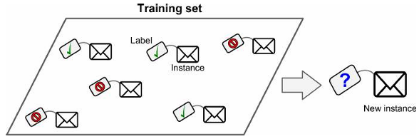
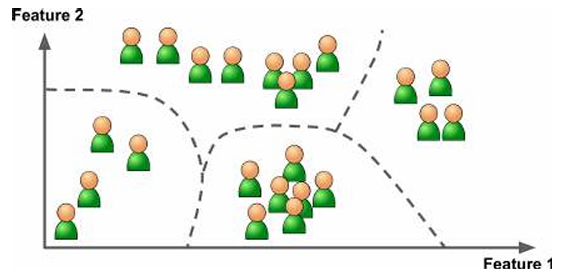
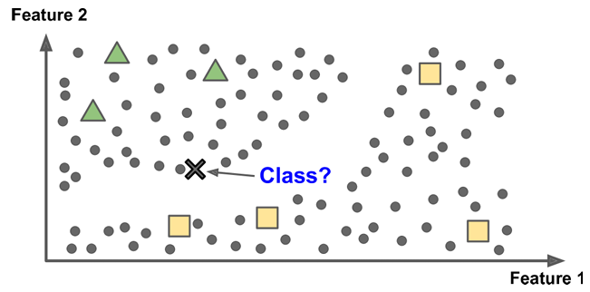
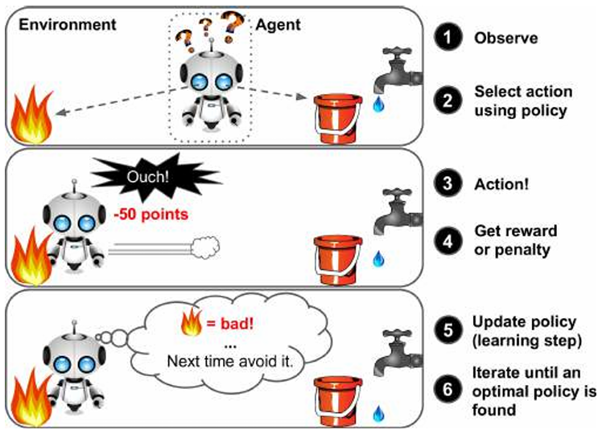
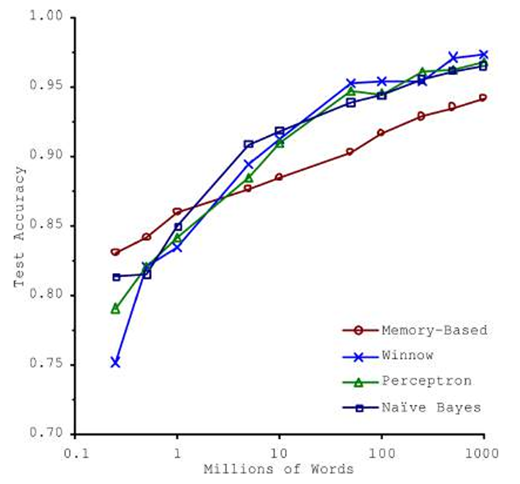
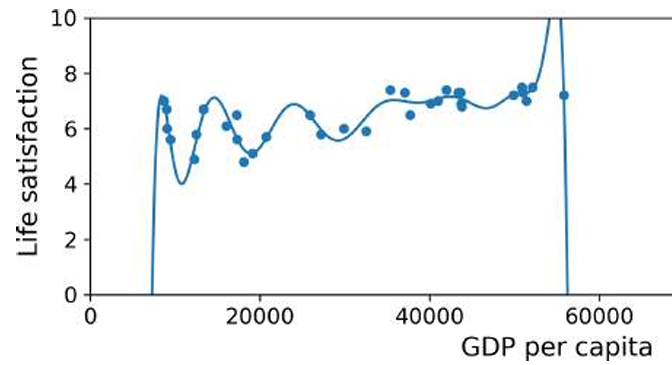

# CS-470: Machine Learning  
### Week 1 — Introduction to Machine Learning  
**Instructor:** Dr. Sajjad Hussain  
**Department of Electrical and Computer Engineering, SEECS, NUST**  
**Date:** September 11, 2025  

---

## Course Logistics

### Course Structure
- Weekly lectures accompanied by **programming tutorial sessions**
- Assessments include:
  - Assignments — 20%
  - Quizzes — 10%
  - Midterm Exam — 30%
  - Final Exam — 40%
- You are **strongly encouraged** to complete Andrew Ng’s *Machine Learning Specialization* on Coursera to reinforce concepts.

> **Note:** Many graphics and figures used in this course are adapted from  
> *Aurélien Géron, Hands-On Machine Learning with Scikit-Learn, Keras, and TensorFlow* (O’Reilly Media).

---

## Week-01 Python Tutorial

A **Python tutorial notebook** is available on the course LMS.  
It covers:
- Basic Python concepts, syntax, and examples  
- Hands-on exercises aligned with lecture content  
- Intended to help you gain fluency in Python for ML  

**Action Item:**  
Download and complete the notebook. Bring any questions to the next class discussion.

---

## Introduction to Machine Learning

### What is Machine Learning?

> *"Field of study that gives computers the ability to learn without being explicitly programmed."* — **Arthur Samuel (1959)**

> *"A computer program is said to learn from experience E with respect to some task T and some performance measure P,  
if its performance on T, as measured by P, improves with experience E."* — **Tom Mitchell (1997)**

In essence:
- Machine Learning (ML) focuses on **building models that generalize** from data.
- Instead of hardcoding rules, we **teach the system to learn from examples**.

---

### Traditional Programming vs Machine Learning

| **Traditional Programming** | **Machine Learning** |
|-----------------------------|----------------------|
| Hand-coded logic | Learns patterns automatically |
| Works well for deterministic, rule-based tasks | Excels at complex or fuzzy problems |

**Visual Comparison:**

|  |  |
|--|--|
|  |  |

> Traditional programming: Rules + Data → Output  
> Machine Learning: Data + Output → Rules (Model)

---

### When to Use Machine Learning

Use ML when:
- Manual rule-writing is **tedious or unreliable** (e.g., spam filtering)  
- The problem has **no known algorithmic solution** (e.g., speech recognition)  
- The environment is **dynamic** and must adapt (e.g., stock prices, weather)  
- You want to **discover insights** from complex data (e.g., healthcare analytics)

---

### Real-World Applications

- Email spam filtering  
- Movie/music recommendation (Netflix, YouTube)  
- Medical diagnosis and drug discovery  
- Self-driving cars and robotics  

---

## Types of Machine Learning

Machine Learning algorithms can be grouped into several broad categories:

---

### 1️⃣ Supervised Learning

In **supervised learning**, training data includes the **correct answers (labels)**.  
The algorithm learns to map inputs → outputs.

Common supervised algorithms:
- k-Nearest Neighbors  
- Linear & Logistic Regression  
- Support Vector Machines (SVMs)  
- Decision Trees & Random Forests  
- Neural Networks

---

### Classification vs Regression

| **Classification** | **Regression** |
|---------------------|----------------|
| Predicts **discrete categories/classes** | Predicts **continuous values** |
| Output: **Label** | Output: **Real number** |
| Examples: Spam vs Not-Spam, Cat vs Dog, Disease +/– | Examples: House price, Temperature, Stock price |
| Metrics: Accuracy, Precision, Recall, F1 | Metrics: MSE, RMSE, MAE, R² |

> Both are forms of **Supervised Learning**, where data includes labeled examples.

---

### 2️⃣ Unsupervised Learning

- Works with **unlabeled data**.  
- The goal is to find **hidden patterns or structures**.

Common techniques:
- **Clustering:** Grouping similar data points  
- **Anomaly detection:** Identifying unusual cases  
- **Dimensionality reduction:** PCA, t-SNE  
- **Association rule learning**

---

### 3️⃣ Semi-Supervised Learning

- Mix of **labeled and unlabeled data**  
- Uses a small labeled subset to label larger unlabeled portions  
- Often used in:
  - Google Photos auto-tagging  
  - News article categorization  

---

### 4️⃣ Reinforcement Learning

- Involves an **agent** that learns by interacting with an **environment**.
- The agent:
  - Takes actions  
  - Receives rewards or penalties  
  - Learns a policy to **maximize total reward over time**

Examples:  
Robotic control, Game playing (e.g., AlphaGo)

---

### Example Datasets

| Type | Example Applications |
|------|----------------------|
| Supervised | Housing prices, Image classification |
| Unsupervised | Customer segmentation, Topic modeling |
| Reinforcement | Game playing, Autonomous vehicles |

---

## Challenges in Machine Learning

### 1️⃣ Insufficient Quantity of Training Data

- ML models require **large datasets** to perform well.
- Complex tasks (e.g., speech recognition) may need **millions** of examples.
- A Microsoft study showed that simple models can outperform complex ones if trained on huge datasets.

*Figure: Importance of Data vs Algorithms*

---

### 2️⃣ Non-Representative Training Data

To generalize well:
- Training data must **reflect real-world cases**.
- Problems:
  - **Sampling noise:** Too few samples  
  - **Sampling bias:** Poorly collected or biased data

**Example:**  
The 1936 U.S. election poll by *Literary Digest* predicted a Republican win — but only surveyed wealthy people.  
FDR (Democrat) won by a landslide.

---

### 3️⃣ Poor-Quality Data

If data contains **errors, outliers, or noise**, the model learns the wrong patterns.

**Data Cleaning Techniques:**
- Remove or correct outliers  
- Handle missing values:
  - Drop missing samples
  - Fill with median/mean
  - Build separate models

> Data cleaning can take up **80% of total ML time** — it’s crucial!

---

### 4️⃣ Irrelevant Features

> Garbage in, garbage out.

A good model depends on relevant, meaningful features.

**Feature Engineering involves:**
- **Feature selection:** Keeping useful variables  
- **Feature extraction:** Combining or transforming features (e.g., PCA)  
- **Creating new features:** Deriving new signals or variables  

---

### 5️⃣ Overfitting the Training Data

**Overfitting:**  
Model performs well on training data but fails on unseen data.

- Occurs when the model is **too complex**
- Learns **noise instead of signal**
- Generalization suffers

*Figure: Model fitting noise instead of true pattern*

---

### Preventing Overfitting

**Simplify the model:**
- Use fewer parameters or simpler models
- Reduce number of features
- Add regularization (penalize complexity)

**Improve the data:**
- Gather more data
- Remove noise/outliers

**Regularization:**
- Adds a penalty to model weights
- Balances model complexity and data fit
- Controlled by a **hyperparameter**

---

### 6️⃣ Underfitting the Data

**Underfitting:**  
Model is too simple to capture the data’s structure.

Symptoms:
- High training and test error
- Model fails to learn patterns

**Fixes:**
- Use more powerful models
- Engineer better features
- Reduce regularization

---

### 7️⃣ Testing and Validating Models

To evaluate generalization:
- Split data into:
  - **Training set** (e.g., 80%)
  - **Test set** (e.g., 20%)

If:
- Training error ↓ but Test error ↑ → **Overfitting**

Goal:
- Achieve low error on both training and unseen data.

---

### 8️⃣ Hyperparameter Tuning and Model Selection

Directly tuning on test set → Overfitting on test data.

**Holdout Validation**
- Split data into Train / Validation / Test sets
- Tune hyperparameters on validation set
- Retrain on full training data
- Evaluate on test set

**Cross-Validation**
- Split data into multiple folds
- Train/evaluate across folds
- Average results for reliable performance estimate

---

### 9️⃣ No Free Lunch Theorem

> *No single model works best for all problems.* — David Wolpert (1996)

Key ideas:
- All models make **assumptions** about data.
- Linear models assume linearity.
- Neural networks assume hierarchical representation.

In practice:
- Choose models based on problem type
- Compare several candidates empirically

---

## Summary of Week 1

This week you learned:

- Definition and motivation for Machine Learning  
- Main types of ML (supervised, unsupervised, reinforcement)  
- Common challenges in ML practice  
- Concepts of overfitting, underfitting, and data quality  
- How to evaluate and validate ML models  
- The importance of model selection and the No Free Lunch theorem

---

### Takeaway

> **Strong data**, **thoughtful model design**, and **rigorous evaluation** are the pillars of successful Machine Learning.

---
